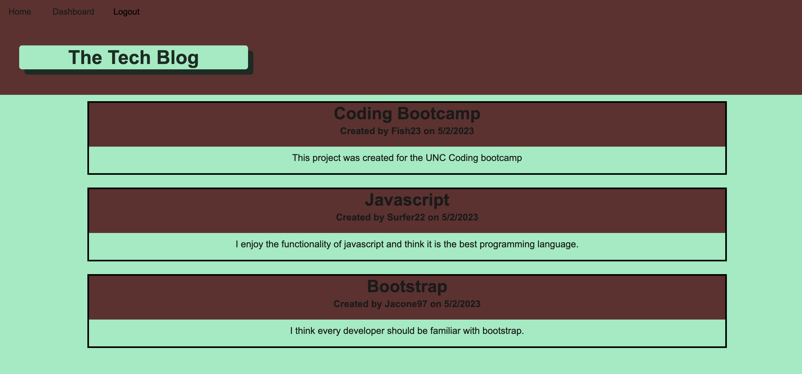
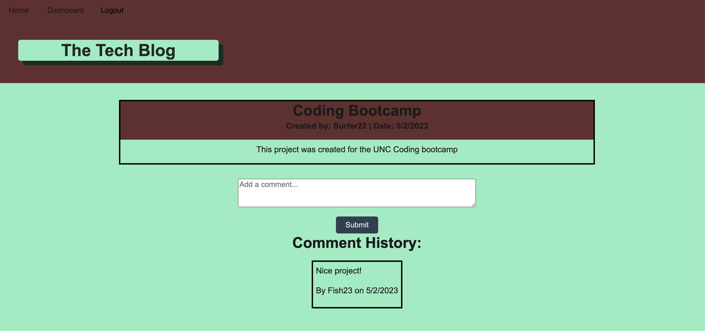
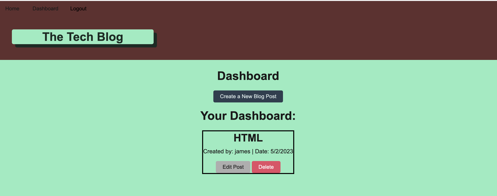

# Tech-Blog

## Description
This application is a tech blog that allows users to post a blog and comment on other blogs. It uses the MVC file structure in order to load dynamic webpages. 

## Installation
N/A

## Usage
A user must navigate to the website by clicking on the heroku link provided. Once there, the user will see a homepage which displays the title and current blog posts.

Once you try to click on a post you will be routed to a login page. If you don't already have a login, you will need to click on sign-up instead. You will be prompted to enter a username and password then can hit enter.

After you login, you will be taken back to the homepage with all of the blog posts. If you click on a specific blog post, you can see the comment history or add a comment yourself.

You can also navigate to the dashboard page. This shows all of your posts and gives you the option to create a new post. You also have the option to edit or delete any of your previous posts by simply clicking on the "edit post" or "Delete" buttons. 

Below is a link to the deployed application:

https://tech-blog-jacone626.herokuapp.com/

## Credits

N/A

## License
Please refer to the license in the repo.
